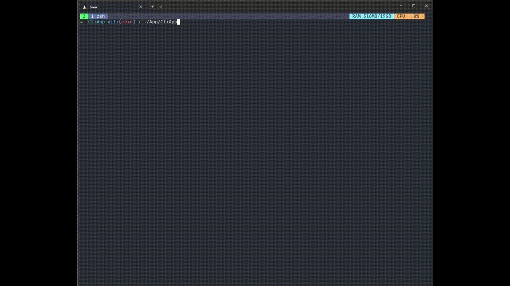
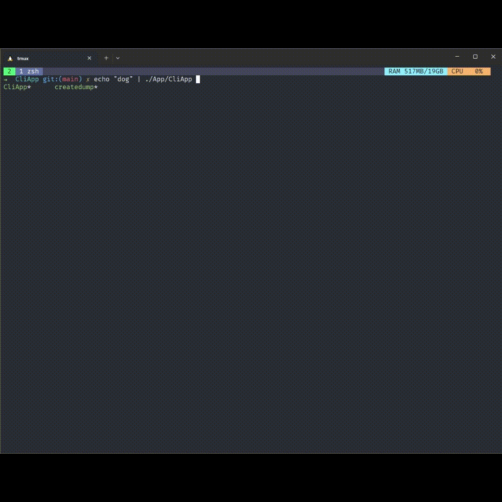

# CLI Trie
This a CLI commada that takes a text file and parse the letter to create a Trie of if. Then, it can make predictions base on the word save on the tried
This project is develop in C# using .Net 8 Core.

# Acknowledgments
- https://github.com/matthewreagan/WebstersEnglishDictionary?tab=readme-ov-file

From Project Gutenberg:
This eBook is for the use of anyone anywhere at no cost and with almost no restrictions whatsoever. You may copy it, give it away or re-use it under the terms of the Project Gutenberg License included with this eBook or online at www.gutenberg.net

